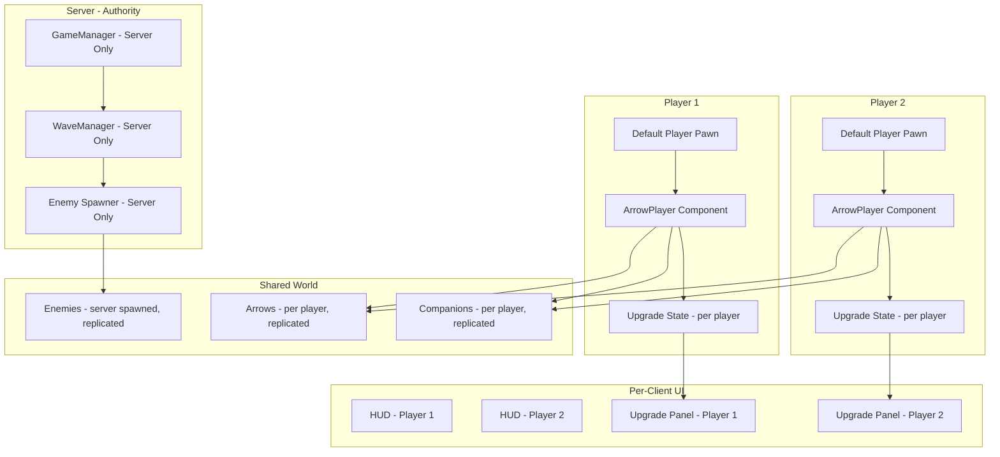

# Arrow a Row — S&Box Implementation Plan

## Game Research Summary (from Steam & Web)

**Arrow a Row** by Lonerangerix is a free-to-play roguelite auto-shooter. Key mechanics:

| Mechanic | Description |
|----------|-------------|
| **Auto-fire** | Player auto-shoots arrows forward; player only controls left/right movement |
| **Wave system** | Enemies spawn from the right, player moves along a horizontal lane |
| **Power-up selection** | After each wave/segment, choose 1 of 3 random upgrades |
| **Upgrade types** | Arrow frequency, damage, speed, distance; swords (orbit); pets (dragons); health; movement speed |
| **Bosses** | Sub-bosses between waves, final dragon boss at the end |
| **Meta-progression** | Permanent upgrades purchasable between runs |
| **Scoring** | High-score chasing; score increases by killing enemies |
| **Pets/Companions** | Dragons that shoot fireballs, flying swords that orbit and strike |

---

## Design Decisions (Confirmed)

| Decision | Choice | Rationale |
|----------|--------|-----------|
| **Multiplayer** | 2-player co-op, expandable | Players fight same waves together; architecture supports N players |
| **Player Controller** | S&Box default built-in | Player pawn already handles movement, networking, camera. We add `ArrowPlayer` component to constrain & auto-fire |
| **Art Style** | Placeholder primitives (cubes/spheres) | Gameplay first; swap models later |
| **Camera** | Third-person behind-character | Matches original game feel |
| **Scope** | Core infinite-run loop first, meta-progression second | Playable ASAP |

---

## Multiplayer Architecture



### Networking Model

- **Server-authoritative**: `GameManager`, `WaveManager`, enemy spawning, score tracking all run on host/server
- **Per-player state**: Each player has their own `ArrowPlayer` component with health, upgrade levels, score synced via `[Sync]`
- **Shared enemies**: Enemies are spawned by server and replicated. Damage dealt by client arrows is validated server-side.
- **Per-client UI**: Each player sees their own HUD and upgrade selection screen independently
- **RPC pattern**: Following the [`sboxreference`](F:/Game%20Development/LLM/sboxreference/Code/Weapons/ToolGun/Toolgun.cs:75) `[Rpc.Host]` pattern for server commands, `[Rpc.Broadcast]` for state sync

---

## Phase 1: Core Gameplay Loop (Multiplayer-Ready)

### 1.1 — Scene & Camera Setup
- **File**: `Assets/scenes/arrow_game.scene` (new)
- Configure [`CameraComponent`](F:/Game%20Development/LLM/api_scene_ui.txt:62) for third-person behind-character view
- Add ground plane, lighting, lane boundary markers
- Place `GameManager` GameObject with component (server-only logic)
- Player spawn points for 2 players

### 1.2 — ArrowPlayer Component (attached to default player)
- **File**: `Code/Player/ArrowPlayer.cs` (new)
- **Does NOT replace** the default player controller — attaches as a component alongside it
- **Lane constraint**: Override/restrict movement to X-axis only (left/right). The default player already reads WASD; we clamp position.
- **Auto-fire**: In [`OnUpdate()`](f:/game%20development/projecte/Code/MyComponent.cs:6), spawn arrows at `FireRate` interval
- **Health**: Synced via `[Sync]` property. On death → game over for that player.
- **Upgrade state**: Per-player dictionary of upgrade levels, synced
- Properties exposed with `[Property]`:
  - `MoveSpeed` (base 300 u/s, clamped to lane)
  - `BaseFireRate` (1.0/s)
  - `MaxHealth` (100)
  - `LaneMinX`, `LaneMaxX` (movement bounds)

### 1.3 — Arrow Projectile
- **File**: `Code/Projectiles/Arrow.cs` (new)
- Simple [`Component`](F:/Game%20Development/LLM/api_scene_ui.txt:33) that moves forward (rightward) each frame
- `Speed`, `Damage`, `Lifetime`, `OwnerId` (which player fired it) properties
- On collision with enemy: call server RPC to apply damage, then destroy
- Visual: [`SceneObject`](F:/Game%20Development/LLM/api_scene_ui.txt:109) with a stretched cube (placeholder arrow shape)
- Object pool for performance (pre-allocate ~50 arrows per player)

### 1.4 — Enemy System
- **File**: `Code/Enemies/Enemy.cs` (new base class)
- Server-spawned, replicated to all clients
- `Health` ([`[Sync]`](F:/Game%20Development/LLM/llms.txt:204)), `Speed`, `Damage`, `ScoreValue`
- Moves leftward toward nearest player (or the lane center)
- On death: grant score to the player who dealt the killing blow
- **Enemy types (subclasses)**:
  - `BasicEnemy` — walks straight, low HP, placeholder cube
  - `FastEnemy` — moves quickly, low HP, smaller cube
  - `TankEnemy` — slow, high HP, larger cube
  - `BossEnemy` — large HP pool, special attack patterns, oversized placeholder

### 1.5 — Wave Spawner (Server Only)
- **File**: `Code/Waves/WaveManager.cs` (new)
- Runs only on server (`if (!Networking.IsHost) return;`)
- Spawns enemies in increasing difficulty waves
- Tracks wave number, enemy count, difficulty multiplier
- Boss spawns at wave milestones (every 5 waves = sub-boss, final boss at wave ~20)
- Pauses between waves to allow upgrade selection
- Scales enemy count for multiplayer: `baseCount * playerCount`
- Uses [`Rpc.Broadcast`](F:/Game%20Development/LLM/sboxreference/Code/Weapons/ToolGun/Toolgun.cs:109) to notify clients of wave changes

---

## Phase 2: Upgrade System

### 2.1 — In-Run Upgrade Data
- **File**: `Code/Upgrades/UpgradeData.cs` (new)
- Define upgrade types:
```csharp
public enum UpgradeType
{
    ArrowFrequency,  // More arrows per second
    ArrowDamage,     // Higher damage per arrow
    ArrowSpeed,      // Faster arrow travel
    ArrowDistance,   // Longer arrow range
    SwordCount,      // More orbiting swords
    SwordDamage,     // Stronger swords
    PetCount,        // More dragon pets
    PetFireRate,     // Faster dragon fireballs
    MovementSpeed,   // Faster player movement
    HealthBoost,     // Restore/boost health
}
```

### 2.2 — Upgrade Selection (Per-Player)
- **File**: `Code/UI/UpgradePanel.razor` (new Razor panel)
- Shown individually to each player between waves (only that player sees their own choices)
- Shows 3 random upgrade choices
- Player clicks one → sends [`[Rpc.Host]`](F:/Game%20Development/LLM/sboxreference/Code/Weapons/ToolGun/Toolgun.cs:75) to server to apply
- Server validates and broadcasts the upgrade application
- Display current upgrade level for each category

### 2.3 — Meta-Progression (Permanent Upgrades) — Phase 2 stretch
- **File**: `Code/Upgrades/MetaUpgradeManager.cs` (new)
- Per-Steam-ID progression stored server-side
- Currency earned per run = score × 0.01
- Shop screen between runs
- Deferred to later phase; core loop has full in-run progression

---

## Phase 3: Companions & Visual Feedback

### 3.1 — Flying Swords
- **File**: `Code/Companions/FlyingSword.cs` (new)
- Orbit around owning player at configurable radius
- Auto-attack nearest enemy within range
- Count scales with `SwordCount` upgrade
- Visual: rotating stretched cube or simple blade placeholder

### 3.2 — Dragon Pets
- **File**: `Code/Companions/DragonPet.cs` (new)
- Follow behind/above owning player
- Auto-shoot fireball projectiles at enemies
- Fire rate scales with `PetFireRate` upgrade, count scales with `PetCount`
- Visual: small floating cube with particle effect

### 3.3 — Visual Polish
- Arrow trail particles (simple line renderer or particle)
- Enemy death flash + shrink
- Floating damage numbers (via [`HudPainter`](F:/Game%20Development/LLM/llms.txt:168))
- Health bar above enemies/bosses (world-space UI)
- Color-coding per player (P1 = blue, P2 = red) for arrow/projectile ownership

---

## Phase 4: UI & Game Flow

### 4.1 — In-Game HUD (Per-Client)
- **File**: `Code/UI/GameHud.razor` (new Razor panel)
- Score display (top-right)
- Wave counter (top-center)
- Health bar (top-left)
- Current upgrade levels (icon strip at bottom)
- Co-op partner status (small panel top-left corner showing partner health)

### 4.2 — Game Over Screen
- **File**: `Code/UI/GameOverPanel.razor` (new)
- Final score per player
- "Spectate" mode if one player still alive
- "Play Again" vote button (both players must agree)
- "Return to Lobby" button

### 4.3 — Lobby / Main Menu
- **File**: `Code/UI/MainMenu.razor` (new)
- Host game / Join game buttons
- Ready-up system for 2 players
- Both players ready → server starts the game scene

### 4.4 — Game State Manager (Server Only)
- **File**: `Code/GameManager.cs` (new)
- Server-authoritative state machine:
  - `Lobby` → waiting for players
  - `Playing` → waves active
  - `UpgradeSelect` → pause between waves (per-player ready tracking)
  - `GameOver` → all players dead
- Orchestrates wave spawning, upgrade pauses, game end
- [`[Sync]`](F:/Game%20Development/LLM/llms.txt:204) current state to all clients

---

## Phase 5: Polish & Balance

### 5.1 — Difficulty Scaling (Multiplayer-Aware)
```csharp
// Enemy stats scale with wave number
float GetEnemyHealth(int wave) => baseHealth * MathF.Pow(1.08f, wave);
float GetEnemySpeed(int wave) => baseSpeed * MathF.Pow(1.03f, wave);

// Enemy count scales with player count
int GetEnemyCount(int wave, int players) 
{
    int baseCount = Math.Min(3 + wave / 2, 15);
    return baseCount * players;
}

// Boss HP also scales with player count
float GetBossHealth(int wave, int players) => baseBossHealth * MathF.Pow(1.10f, wave) * (0.7f + 0.3f * players);
```

### 5.2 — Balance Parameters

| Parameter | Base | Per Upgrade | Max |
|-----------|------|-------------|-----|
| Arrow Frequency | 1.0/s | +0.3/s | 10.0/s |
| Arrow Damage | 10 | +5 | 100 |
| Arrow Speed | 500 u/s | +100 u/s | 3000 u/s |
| Arrow Distance | 800 u | +200 u | 4000 u |
| Sword Count | 0 (unlock) | +1 | 8 |
| Sword Damage | 15 | +8 | 150 |
| Pet Count | 0 (unlock) | +1 (×2 after boss) | 6 |
| Pet Fire Rate | 1.0/s | +0.5/s | 8.0/s |
| Movement Speed | 300 u/s | +50 u/s | 1000 u/s |
| Player Health | 100 | +20 (heal) | 300 |

### 5.3 — Achievements (Future)
Use S&Box [`Achievements`](F:/Game%20Development/LLM/llms.txt:209) service:
- Defeat first boss
- Reach score 1000, 5000, 10000
- Max out each upgrade type
- Complete run without taking damage
- Co-op specific: both players survive to final boss

---

## File Structure (Planned)

```
projecte/
├── Code/
│   ├── Assembly.cs                          (exists — update globals)
│   ├── GameManager.cs                       (NEW — server-authoritative state machine)
│   ├── Player/
│   │   └── ArrowPlayer.cs                   (NEW — component attached to default player)
│   ├── Projectiles/
│   │   ├── Arrow.cs                        (NEW)
│   │   └── Fireball.cs                     (NEW — dragon pet projectile)
│   ├── Enemies/
│   │   ├── Enemy.cs                        (NEW — base)
│   │   ├── BasicEnemy.cs                   (NEW)
│   │   ├── FastEnemy.cs                    (NEW)
│   │   ├── TankEnemy.cs                    (NEW)
│   │   └── BossEnemy.cs                    (NEW)
│   ├── Waves/
│   │   └── WaveManager.cs                  (NEW — server only)
│   ├── Upgrades/
│   │   ├── UpgradeData.cs                  (NEW)
│   │   ├── UpgradeManager.cs               (NEW — in-run, per-player)
│   │   └── MetaUpgradeManager.cs           (NEW — permanent, deferred)
│   ├── Companions/
│   │   ├── FlyingSword.cs                  (NEW)
│   │   └── DragonPet.cs                    (NEW)
│   └── UI/
│       ├── GameHud.razor                   (NEW)
│       ├── UpgradePanel.razor              (NEW)
│       ├── GameOverPanel.razor             (NEW)
│       └── MainMenu.razor                  (NEW)
├── Assets/
│   └── scenes/
│       ├── minimal.scene                    (exists)
│       └── arrow_game.scene                 (NEW — main game scene)
└── ProjectSettings/
    └── Input.config                         (exists — add ArrowRow input group)
```

---

## Implementation Order

| Step | Task | Dependencies | Networking Impact |
|------|------|-------------|-------------------|
| 1 | Create `arrow_game.scene` with camera, ground, lighting, player spawns | None | Server hosts scene |
| 2 | Implement `ArrowPlayer` component (lane clamp + auto-fire + health) | Step 1 | Per-player [Sync] health |
| 3 | Implement `Arrow` projectile + pooling | Step 2 | Server-validated damage |
| 4 | Implement `Enemy` base + `BasicEnemy` + `FastEnemy` + `TankEnemy` | Step 1 | Server-spawned, replicated |
| 5 | Implement `WaveManager` (server-only wave spawning) | Steps 3, 4 | Server authority, RPC broadcasts |
| 6 | Implement `GameManager` state machine (Lobby→Playing→UpgradeSelect→GameOver) | Steps 2-5 | Server state machine, [Sync] to clients |
| 7 | Implement `UpgradeData` + per-player `UpgradeManager` | Step 5 | Rpc.Host for selections, server validates |
| 8 | Implement `UpgradePanel.razor` (per-client, shown between waves) | Step 7 | Per-client UI, no direct networking |
| 9 | Implement `GameHud.razor` (score, health, wave, partner status) | Step 6 | Reads [Sync] properties |
| 10 | Implement `FlyingSword` companion | Step 7 | Per-player, replicated |
| 11 | Implement `DragonPet` companion | Step 7 | Per-player, replicated |
| 12 | Implement `BossEnemy` variants | Step 4 | Server-spawned, more HP for more players |
| 13 | Implement `GameOverPanel.razor` + `MainMenu.razor` (lobby system) | Step 6 | Ready-up system, scene transitions |
| 14 | Implement `MetaUpgradeManager` (permanent progression, per Steam ID) | Step 6 | Server-side persistence |
| 15 | Balance tuning, visual polish, playtesting with 2 players | All | Latency compensation, hit validation |

---

## Key Networking Patterns

Following the [`sboxreference` Toolgun](F:/Game%20Development/LLM/sboxreference/Code/Weapons/ToolGun/Toolgun.cs:1) patterns:

```csharp
// Server-only guard
if (!Networking.IsHost) return;

// Synced property
[Sync] public float Health { get; set; } = 100f;

// Client → Server command
[Rpc.Host]
public void SelectUpgrade(UpgradeType type) { ... }

// Server → All clients broadcast
[Rpc.Broadcast]
public void OnWaveComplete(int wave) { ... }

// Per-player UI (no networking needed — each client reads their own state)
protected override void OnUpdate()
{
    // UI reads local player's synced state
}
```

---

## Defaults Assumed

| Decision | Default |
|----------|---------|
| Art style | Placeholder cubes/spheres (gameplay-first) |
| Camera | Third-person behind-character |
| Scope | Core loop first, meta-progression later |
| Lane layout | Single shared lane (both players fight same enemies) |
| Player limit | 2 (configurable, architecture supports N) |
