# Custom NetworkHelper Plan

Based on clover_meadows' reference pattern. Three files to change, then scene edits.

---

## File 1: NEW — `Code/NetworkHelper.cs`

Adapted from [`clover_meadows_sbox/code/NetworkHelper.cs`](F:\Game Development\LLM\GameReferences\clover_meadows_sbox\code\NetworkHelper.cs). Covers:
- `OnLoad()` — `Networking.CreateLobby()` if not already active
- `OnActive()` — spawn PlayerPrefab for each connecting client
- `FindSpawnLocation()` — use SpawnPoints or fall back to SpawnPoint components
- `PlayerPrefab` + `SpawnPoints` properties (editable in scene)

## File 2: MODIFY — `Code/GameManager.cs`

**IMPORTANT**: The GameManager must KEEP its `SpawnPlayersForAllConnections()` and `PlayerPrefab` property. Here's why:

The custom `NetworkHelper.OnActive()` only fires when a **client initially connects** — just like the built-in one. It does NOT fire when a **scene transitions**. So when the host loads the game scene from the lobby, already-connected clients won't get their ArrowPlayer spawned by `OnActive()` — the GameManager's `SpawnPlayersForAllConnections()` is the only thing that handles this.

So the split of responsibilities is:
- **NetworkHelper**: Server creation (`Networking.CreateLobby`) + spawning on initial connect
- **GameManager**: Spawning on scene transition (`SpawnPlayersForAllConnections`) + late join via `OnActive()`

Changes to GameManager:
- Keep `[Property] public GameObject PlayerPrefab`
- Keep `SpawnPlayersForAllConnections()`
- Keep `OnActive()`
- Keep `ISceneStartup`
- Keep ready state sync
- The only change is that `Networking.CreateLobby` is now handled by NetworkHelper instead of GameManager

## File 3: EDIT — Both Scenes (editor work)

1. Open **lobby.scene** → find the GameObject with `Sandbox.NetworkHelper` → remove that component → add custom `NetworkHelper` component → assign PlayerPrefab (same "Player Controller" prefab) → assign SpawnPoints

2. Open **arrow_game.scene** → same process → assign PlayerPrefab (the one with ArrowPlayer) → assign SpawnPoints

---

## Mermaid Flow (After Changes)

```mermaid
flowchart LR
    A[Game Starts] --> B[Scene: lobby.scene]
    B --> C{NetworkHelper.OnLoad}
    C -->|StartServer=true| D[Networking.CreateLobby]
    D --> E[Client connects]
    E --> F[NetworkHelper.OnActive]
    F --> G[Clone PlayerPrefab at SpawnPoint]
    G --> H[player.NetworkSpawn channel]
    H --> I[PlayerController in lobby]
    I --> J[Host presses START]
    J --> K[GameManager.HostStartGame]
    K --> L[Game.ActiveScene.LoadFromFile]
    L --> M[Scene: arrow_game.scene]
    M --> N{NetworkHelper.OnLoad}
    N -->|Networking.IsActive=true| O[Skip CreateLobby]
    M --> P[GameManager.OnStart]
    P --> Q[State=Playing detected]
    Q --> R[SpawnPlayersForAllConnections]
    R --> S[For each Connection: Clone PlayerPrefab + NetworkSpawn]
    S --> T[ArrowPlayer + PlayerController spawned]
```



---

## Code for `Code/NetworkHelper.cs`

```csharp
using System.Threading.Tasks;
using Sandbox.Network;

[Title("Network Helper")]
[Category("Networking")]
[Icon("electrical_services")]
public sealed class NetworkHelper : Component, Component.INetworkListener
{
    [Property]
    public bool StartServer { get; set; } = true;

    [Property]
    public GameObject PlayerPrefab { get; set; }

    [Property]
    public List<GameObject> SpawnPoints { get; set; }

    protected override async Task OnLoad()
    {
        if (Scene.IsEditor)
            return;

        if (StartServer && !Networking.IsActive)
        {
            LoadingScreen.Title = "Creating Lobby";
            await Task.DelayRealtimeSeconds(0.1f);
            Networking.CreateLobby(new LobbyConfig());
        }
    }

    public void OnActive(Connection channel)
    {
        if (!PlayerPrefab.IsValid())
            return;

        var startLocation = FindSpawnLocation().WithScale(1);
        var player = PlayerPrefab.Clone(startLocation, name: $"Player - {channel.DisplayName}");
        player.NetworkSpawn(channel);
    }

    Transform FindSpawnLocation()
    {
        if (SpawnPoints is not null && SpawnPoints.Count > 0)
            return Random.Shared.FromList(SpawnPoints, default).Transform.World;

        var spawnPoints = Scene.GetAllComponents<SpawnPoint>().ToArray();
        if (spawnPoints.Length > 0)
            return Random.Shared.FromArray(spawnPoints).Transform.World;

        return Transform.World;
    }
}
```
