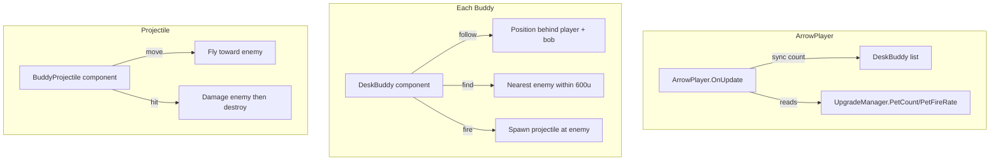

# Desk Buddy — Coffee Dog Companion

## Behavior
Floating dog that follows behind the player, bobs up and down, and shoots coffee/fireball projectiles at enemies.

## Mechanics

| Property | Default | Per PetCount Upgrade | Per PetFireRate Upgrade |
|----------|---------|---------------------|------------------------|
| Count | 0 (unlock first at PetCount=1) | +1 dog | - |
| Fire Rate | 1 shot/s | - | +0.5/s |
| Projectile Damage | 5 | - | - |
| Projectile Speed | 400 | - | - |
| Projectile Range | 600 | - | - |

## Positioning
- Dogs spaced evenly behind player
- 1 dog: X offset = 0 (behind), Y offset = -100
- 2 dogs: X offset = -60 and +60
- 3 dogs: X offset = -120, 0, +120
- Bobbing: sine wave on Z axis at 2Hz, 5 unit amplitude

## Architecture



## Files

| File | Action | Details |
|------|--------|---------|
| [`Code/Companions/DeskBuddy.cs`](Code/Companions/DeskBuddy.cs) | **NEW** | Following + bobbing + auto-fire buddy. Looks at nearest enemy. |
| [`Code/Companions/BuddyProjectile.cs`](Code/Companions/BuddyProjectile.cs) | **NEW** | Simple projectile: flies toward target, damages on contact. |
| [`Code/Player/ArrowPlayer.cs`](Code/Player/ArrowPlayer.cs) | **MODIFY** | Add DogModel property, DogFireSound/Volume, buddy lifecycle (sync count/damage). |
| [`Code/Upgrades/UpgradeManager.cs`](Code/Upgrades/UpgradeManager.cs) | Already done | PetCount, PetFireRate already in available upgrades. |
| [`Code/UI/GameHud.razor`](Code/UI/GameHud.razor) | **MODIFY** | Add buddy stats to HUD + BuildHash. |
| [`Code/UI/UpgradePanel.razor`](Code/UI/UpgradePanel.razor) | Already done | Names "Pets" and "Pet Rate" already set. |

## DeskBuddy Component Detail

```csharp
public sealed class DeskBuddy : Component
{
    [Property] public float FollowOffsetX { get; set; } = 60f;
    [Property] public float FollowOffsetY { get; set; } = -100f;
    [Property] public float FollowOffsetZ { get; set; } = 20f;
    [Property] public float BobSpeed { get; set; } = 2f;
    [Property] public float BobHeight { get; set; } = 5f;
    [Property] public float FireRate { get; set; } = 1f;
    [Property] public float ProjectileSpeed { get; set; } = 400f;
    [Property] public float ProjectileDamage { get; set; } = 5f;
    [Property] public float ProjectileRange { get; set; } = 600f;
    [Property] public Guid OwnerId { get; set; }
    [Property] public int BuddyIndex { get; set; } = 0; // for spacing
    [Property] public int BuddyCount { get; set; } = 1; // total count for spacing
    [Property] public Model DogModel { get; set; }
    [Property] public SoundEvent FireSound { get; set; }
    [Property] public float FireVolume { get; set; } = 1f;

    private ArrowPlayer _owner;
    private TimeSince _timeSinceFire = 0;
    private int _totalBuddies;
    private int _buddyIndex;
    
    OnStart:
        Find owner by OwnerId
        Set visual model from DogModel or fallback to cube
    
    OnFixedUpdate (server only):
        if _owner is invalid → cleanup
        
        // Calculate position offset
        int count = total buddies from _owner
        int index = this buddy's index
        // Spread: if 1 dog → x=0, if 2 dogs → x=-60,+60, if 3 → x=-120,0,+120
        float spacing = count > 1 ? 120f / (count - 1) : 0f;
        float xOffset = -60f + (index * spacing);
        
        // Bob up and down
        float zBob = MathF.Sin(Time.Now * BobSpeed + index) * BobHeight;
        
        Vector3 target = _owner.WorldPosition;
        target.x += xOffset;
        target.y += FollowOffsetY;
        target.z += FollowOffsetZ + zBob;
        WorldPosition = target;
        
        // Aim at nearest enemy
        Enemy nearest = find nearest alive enemy within 800u
        if nearest != null:
            rotate to face enemy
        
        // Auto-fire
        float fireRate = get from owner
        if _timeSinceFire >= 1f / fireRate && nearest != null:
            Fire(nearest)
    
    Fire(Enemy target):
        spawn BuddyProjectile at own position
        set projectile target/damage/speed
        play fire sound
        _timeSinceFire = 0
```

## BuddyProjectile Component Detail

```csharp
public sealed class BuddyProjectile : Component
{
    [Property] public float Speed = 300f;
    [Property] public float Damage = 5f;
    [Property] public Guid OwnerId;
    [Property] public GameObject Target;
    
    OnFixedUpdate:
        if Target is invalid → destroy
        if Target enemy is dead → destroy
        
        // Move toward target
        dir = (Target.WorldPosition - WorldPosition).Normal;
        WorldPosition += dir * Speed * Time.Delta;
        WorldRotation = Rotation.LookAt(dir);
        
        // Hit check
        if distance to target < 30f:
            enemy.TakeDamage(Damage, OwnerId);
            GameObject.Destroy();
```

## ArrowPlayer Changes

```csharp
// New properties:
[Property] public Model DogModel { get; set; }
[Property] public SoundEvent DogFireSound { get; set; }
[Property, Range(0,1)] public float DogFireVolume { get; set; } = 1f;

// New fields:
private List<DeskBuddy> _deskBuddies = new();

// New methods:
public int GetBuddyCount() => _um?.CurrentUpgrades?.PetCount ?? 0;
public float GetBuddyFireRate() => 1f + (_um?.CurrentUpgrades?.PetFireRate ?? 0) * 0.5f;

// In OnUpdate (alongside shredder sync):
if (Networking.IsHost) SyncBuddies();

// In Die():
CleanupBuddies();
```

## HUD Changes
Add to stats panel:
```
Dogs: X | Rate: Y/s
```
