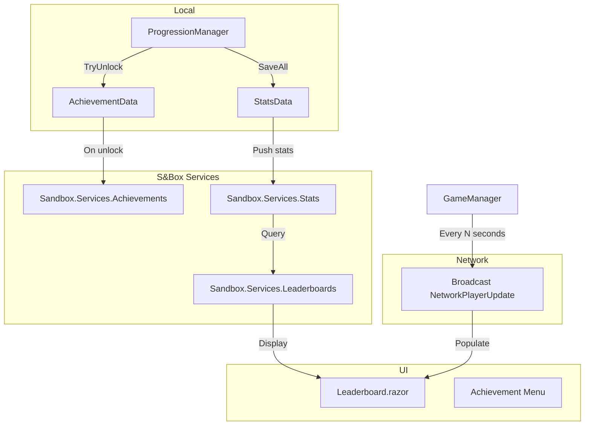

# Leaderboard & Achievement Service Integration Plan

Based on pizza_clicker's implementation at [`F:\Game Development\LLM\GameReferences\pizza_clicker\code`](F:/Game Development/LLM/GameReferences/pizza_clicker/code).

---

## Architecture Overview



---

## Step 1: Wire Achievements to S&Box Service

**File:** [`Code/Progression/ProgressionManager.cs`](Code/Progression/ProgressionManager.cs)

**Change:** In `TryUnlock()`, after locally unlocking and awarding Staples, add a call to `Sandbox.Services.Achievements.Unlock(id)`.

```csharp
private void TryUnlock( string id, Func<bool> condition )
{
    if ( !Achievements.IsUnlocked( id ) && condition() )
    {
        Achievements.Unlock( id );

        // Award Staples reward
        foreach ( var a in AchievementData.All )
        {
            if ( a.Id == id )
            {
                Currency.Staples += a.StapleReward;
                Log.Info( $"Achievement unlocked: {a.Name} (+{a.StapleReward} Staples)" );
                break;
            }
        }

        // ★ NEW: Register with S&Box global achievement service
        Sandbox.Services.Achievements.Unlock( id );
    }
}
```

**What it does:** When any achievement is unlocked locally, it also registers with S&Box's cloud achievement service, making it visible on the player's profile.

---

## Step 2: Push Stats to S&Box Service

**File:** [`Code/Progression/ProgressionManager.cs`](Code/Progression/ProgressionManager.cs)

**Change:** Add a new method `PushStatsToService()` that sends key metrics to `Sandbox.Services.Stats.SetValue()`. Call it from `SaveAll()` and `AwardRun()`.

```csharp
/// <summary>Push key metrics to S&Box global stat tracking service.</summary>
public void PushStatsToService()
{
    Sandbox.Services.Stats.SetValue( "highest_wave", Stats.HighestWaveReached );
    Sandbox.Services.Stats.SetValue( "total_enemies_killed", Stats.TotalEnemiesKilled );
    Sandbox.Services.Stats.SetValue( "total_damage_dealt", Stats.TotalDamageDealt );
    Sandbox.Services.Stats.SetValue( "total_runs", Stats.TotalRunsPlayed );
    Sandbox.Services.Stats.SetValue( "total_time_seconds", (long)Stats.TotalTimePlayedSeconds );
    Sandbox.Services.Stats.SetValue( "total_paperclips", Stats.TotalPaperclipsEarned );
}
```

Call this at the end of `AwardRun()` and `SaveAll()`.

**Stat IDs to define in S&Box project settings:**

| Stat ID | Type | Description |
|---------|------|-------------|
| `highest_wave` | int | Highest wave reached in any run |
| `total_enemies_killed` | int | Total enemies killed across all runs |
| `total_damage_dealt` | int | Total damage dealt across all runs |
| `total_runs` | int | Total runs played |
| `total_time_seconds` | long | Total play time in seconds |
| `total_paperclips` | int | Total Paperclips earned |

---

## Step 3: Network Stats Broadcast (for In-Session Leaderboard)

**File:** [`Code/GameManager.cs`](Code/GameManager.cs)

**Change:** Add a `[Broadcast]` method to share per-player stats with all connected clients, following pizza_clicker's `NetworkPlayerUpdate` pattern. Send every 3 seconds during play.

```csharp
[Sync] public int NetHighestWave { get; set; }
[Sync] public int NetEnemiesKilled { get; set; }
[Sync] public int NetPaperclips { get; set; }
[Sync] public float NetPlayTime { get; set; }

// In OnUpdate(), add periodic broadcast:
if ( _lastLeaderboardSync > 3f && Progression != null )
{
    _lastLeaderboardSync = 0;
    BroadcastPlayerStats( 
        Progression.Stats.HighestWaveReached,
        Progression.Stats.TotalEnemiesKilled,
        Progression.Currency.Paperclips,
        Progression.Stats.TotalTimePlayedSeconds
    );
}

[Broadcast]
public void BroadcastPlayerStats( int highestWave, int enemiesKilled, int paperclips, float playTime )
{
    // Store received data for leaderboard display
    // Each connection's data is stored in a dictionary keyed by Caller.SteamId
}
```

---

## Step 4: Leaderboard UI Component

**New File:** [`Code/UI/LeaderboardPanel.razor`](Code/UI/LeaderboardPanel.razor)

A Razor component styled in Terminal CLI theme that:
- Shows a list of connected players ranked by stats
- Uses the broadcast data from Step 3 for in-session rankings
- Has a toggle button to show/hide (like pizza_clicker's leaderboard)
- Can optionally query `Sandbox.Services.Leaderboards` for global rankings

**Key data structure:**
```csharp
private List<LeaderboardEntry> _entries = new();

struct LeaderboardEntry
{
    public string Name;
    public int HighestWave;
    public int EnemiesKilled;
    public int Paperclips;
}

// Received from BroadcastPlayerStats
public void OnPlayerStats( ulong steamId, string name, int highestWave, int enemiesKilled, int paperclips )
{
    var entry = _entries.FirstOrDefault( e => e.SteamId == steamId );
    if ( entry == null )
        _entries.Add( new LeaderboardEntry { ... } );
    else
        entry.Update( ... );
}
```

**Add to MainMenuPanel:** Insert the leaderboard as a toggleable panel alongside Shop/Achievements (or as a button that opens it).

---

## Step 5: Leaderboard SCSS Styles

**New File:** [`Code/UI/LeaderboardPanel.razor.scss`](Code/UI/LeaderboardPanel.razor.scss)

Terminal CLI theme matching the main menu:
- Bracket-style header `[ LEADERBOARD ]`
- Player rows with `$` prompts
- Rank numbers `#1`, `#2`, etc.
- Green-on-black monospace styling

---

## Files Summary

| # | File | Action | Description |
|---|------|--------|-------------|
| 1 | [`Code/Progression/ProgressionManager.cs`](Code/Progression/ProgressionManager.cs) | Modify | Add `Sandbox.Services.Achievements.Unlock()` in `TryUnlock()` |
| 2 | [`Code/Progression/ProgressionManager.cs`](Code/Progression/ProgressionManager.cs) | Modify | Add `PushStatsToService()` method, call from `SaveAll()`/`AwardRun()` |
| 3 | [`Code/GameManager.cs`](Code/GameManager.cs) | Modify | Add `[Broadcast] BroadcastPlayerStats()` + periodic sync timer |
| 4 | [`Code/UI/LeaderboardPanel.razor`](Code/UI/LeaderboardPanel.razor) | Create | Leaderboard UI component with Terminal CLI style |
| 5 | [`Code/UI/LeaderboardPanel.razor.scss`](Code/UI/LeaderboardPanel.razor.scss) | Create | Terminal-themed SCSS for leaderboard |
| 6 | [`Code/UI/MainMenuPanel.razor`](Code/UI/MainMenuPanel.razor) | Modify | Add leaderboard toggle button + panel rendering |

---

## Dependencies

- Requires defining stat IDs in S&Box project settings (ProjectSettings → Stats)
- Requires achievement IDs registered in S&Box project settings for `Sandbox.Services.Achievements.Unlock()` to work
- The `[Broadcast]` attribute requires networking to be active

## Testing

1. Run the game, play a round, verify achievements unlock locally AND register with service
2. Check that stats appear in `Sandbox.Services.Stats` after a run
3. Verify leaderboard shows other connected players' data
4. Test with multiple clients to verify broadcast sync
