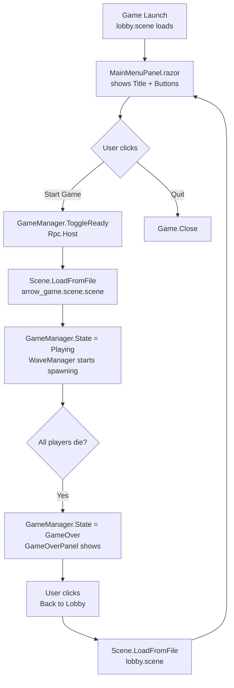
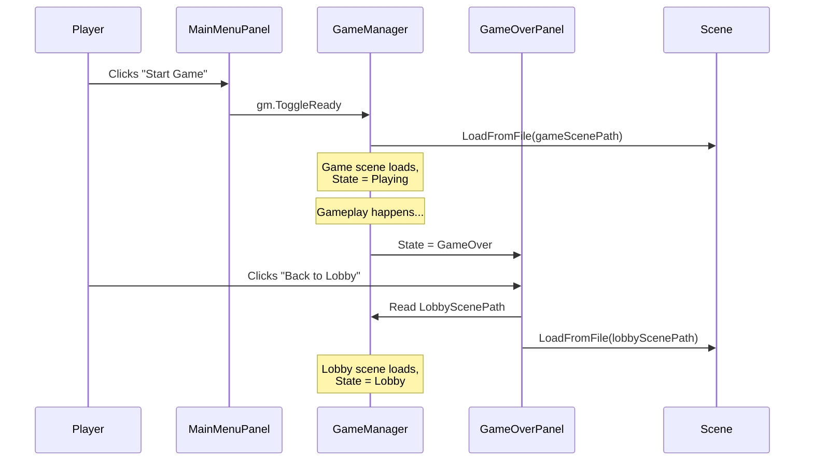

# Main Menu & Scene Transition Plan

## Reference Analysis Summary

Examined four S&Box reference games for main menu patterns:

| Game | Menu Scene | UI Pattern | Scene Loading |
|------|-----------|------------|---------------|
| sbox-hc1 | `menu.scene` | NavigationHost with URL routing | `ResourceLibrary.Get<SceneFile>()` + `Game.ActiveScene.Load()` |
| Voxel-Party | `Menu.scene` | State-machine enum | `Networking.CreateLobby()` + `Scene.LoadFromFile()` |
| grubs | `main_menu.scene` | Button handlers + panel transitions | `Scene.LoadFromFile("scenes/beach.scene")` |
| clover_meadows | `mainmenu.scene` | State-machine enum | `Game.ActiveScene.LoadFromFile("scenes/clover.scene")` |

**Common patterns:**
1. Dedicated main menu scene (separate from game scene)
2. `Scene.LoadFromFile()` for all transitions
3. `PanelComponent`-based Razor UI with `@onclick="@(() => method())"` lambdas
4. State-machine or conditional rendering for nested menu states

**Key design insight (post-research):**
- **None of the reference games implement multiplayer in the main menu scene.**
- Multiplayer is only active once inside the game scene.
- The main menu is a purely single-player title screen.
- Therefore: `MainMenuPanel.razor` must NOT show connection info, player lists, or host-only controls.

---

## Current ProjectE Issues

| # | Issue | File | Impact |
|---|-------|------|--------|
| 1 | `OnPlayAgain()` loads `minimal.scene` instead of `lobby.scene` | `Code/UI/GameOverPanel.razor:155` | Game over doesn't return to proper menu |
| 2 | `LobbyManager.cs` is redundant | N/A | `GameManager` already handles state |
| 3 | `HudManager` adds LobbyPanel to both scenes (now MainMenuPanel) | `Code/UI/HudManager.cs:27` | Works via conditional, but suboptimal |
| 4 | No `LobbyScenePath` property on `GameManager` | `Code/GameManager.cs` | Hardcoded `minimal.scene` in GameOverPanel |

---

## Proposed Plan

### Step 1: Enhance `GameManager.cs` with Lobby Scene Path

Add a `[Property]` for the lobby scene path so it's configurable from the editor, consistent with `GameScenePath`.

```csharp
[Property]
public string LobbyScenePath { get; set; } = "assets/scenes/lobby.scene";
```

### Step 2: Rename `LobbyPanel.razor` → `MainMenuPanel.razor`

Upgrade the current basic lobby panel into a proper main menu screen with:
- Game title: "Project E"
- Subtitle: "Office Clearance Simulator"
- "Start Game" button → calls `gm.ToggleReady()` (which loads game scene)
- "Quit" button → calls `Game.Close()`
- Stylish dark gradient background

### Step 3: Fix `GameOverPanel.OnPlayAgain()`

Change from:
```csharp
Scene.LoadFromFile( "assets/scenes/minimal.scene" );
```
To:
```csharp
var gm = Scene.GetAllComponents<GameManager>().FirstOrDefault();
var path = gm?.LobbyScenePath ?? "assets/scenes/lobby.scene";
Scene.LoadFromFile( path );
```

This ensures the game over screen always returns to the proper lobby/main menu scene, using the configurable path from `GameManager`.

### Step 4: Clean Up Redundant `LobbyManager.cs`

Since `GameManager` already handles:
- State machine (Lobby, Playing, UpgradeSelect, GameOver)
- Scene loading via `ToggleReady()` → `Scene.LoadFromFile(GameScenePath)`
- All state transitions

The `LobbyManager.cs` file is redundant and can be removed. The existing `GameManager.ToggleReady()` has `[Rpc.Host]` which is correct for network safety.

### Step 5: Update `HudManager.cs`

Rename the `LobbyPanel` reference to `MainMenuPanel`:
```csharp
// Before:
_uiRoot.AddComponent<Sandbox.UI.LobbyPanel>();
// After:
_uiRoot.AddComponent<Sandbox.UI.MainMenuPanel>();
```

### Step 6: Verify Scene Paths

Ensure all scene paths use consistent format:
- `lobby.scene` - main menu / title screen (NOT `.scene.scene`)
- `arrow_game.scene.scene` - gameplay scene (NOTE: S&Box generates `.scene.scene` extension for scenes with maps)

Verify:
- `GameManager.GameScenePath` = `"assets/scenes/arrow_game.scene.scene"` ✅ already correct
- `GameManager.LobbyScenePath` = `"assets/scenes/lobby.scene"` (new)
- `GameOverPanel` loads from `gm.LobbyScenePath` ✅

---

## Flow Diagram



---

## Files to Modify

| File | Change |
|------|--------|
| `Code/GameManager.cs` | Add `LobbyScenePath` property |
| `Code/UI/LobbyPanel.razor` → `Code/UI/MainMenuPanel.razor` | Rename + enhance with quit button |
| `Code/UI/GameOverPanel.razor` | Use `gm.LobbyScenePath` instead of hardcoded `minimal.scene` |
| `Code/UI/HudManager.cs` | Reference `MainMenuPanel` instead of `LobbyPanel` |
| `Code/Lobby/LobbyManager.cs` | Delete (redundant) |

## Files to Create

| File | Purpose |
|------|---------|
| `Code/UI/MainMenuPanel.razor` | Renamed from LobbyPanel.razor with enhanced styling and Quit button |

---

## Sequence Diagram



---

## Key Technical Decisions

1. **Use `GameManager.LobbyScenePath`** instead of hardcoded paths — makes it editor-configurable
2. **Keep `[Rpc.Host]` on `ToggleReady`** — ensures only host can trigger scene load (network safety)
3. **Maintain the conditional rendering pattern** (`@if (isLobby)`) — MainMenuPanel auto-hides in game scene
4. **Game.Close() for Quit** — matches grubs and clover_meadows patterns
5. **Delete LobbyManager.cs** — all functionality now lives in GameManager
