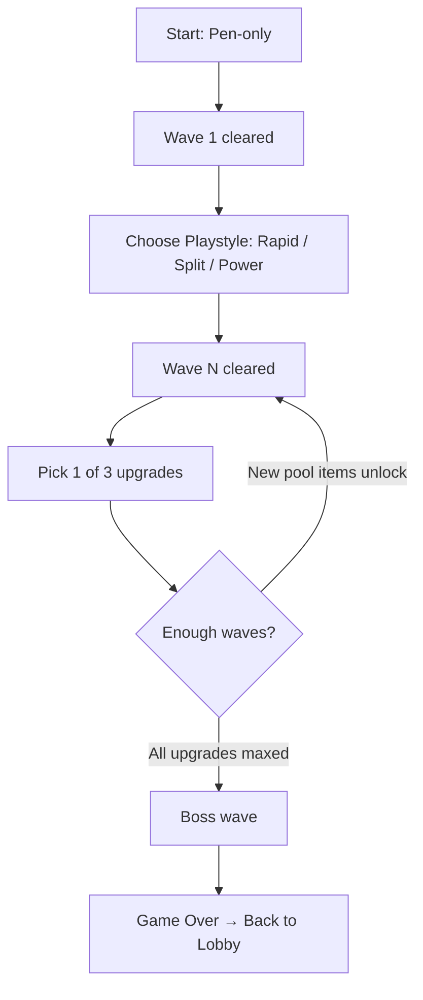

# Progression System Plan — Addictive Roguelike Loop

## Overview

Restore the Wave 1 playstyle choice, then give the player **pick 1 of 3** upgrades every wave. The upgrade pool expands as you progress — companions are discoveries, not defaults. Gate values are balanced for a smooth power curve.

---

## Core Loop



---

## Step 1: Restore Wave 1 Playstyle Choice

**Files:** [`Code/GameManager.cs`](Code/GameManager.cs), [`Code/Player/ArrowPlayer.cs`](Code/Player/ArrowPlayer.cs)

Revert the Pen-only changes for the playstyle system:
- In `GameManager.OnWaveCompleted()`, add back `if (wave == 1 && !PlaystyleChosen) return;` so wave 1 pauses for playstyle selection
- In `ArrowPlayer.OnUpdate()`, change `BaseFireRate` back to `PlaystyleBaseFireRate + GetFireRateBonus()`
- In `ArrowPlayer.SpawnPen()`, change `ArrowSpeed/Damage/Distance` back to `PlaystyleArrowSpeed/Damage/Distance + bonus`

**Playstyle baseline values** (from the balance plan):

| Playstyle | Fire Rate | Dmg/Pen | Pens/Throw | Total DPS |
|-----------|-----------|---------|------------|-----------|
| Rapid Fire | 3/s | 6 | 1 | 18 |
| Split Shot | 1.5/s | 7 | 3 | 31.5* |
| Power Shot | 0.6/s | 30 | 1 | 18 |

*Split Shot is higher DPS because damage is spread — often only 1-2 pens hit a single target.*

The `UpgradePanel.razor` already handles playstyle selection UI — it's intact and working.

---

## Step 2: Upgrade Pool Expansion (Wave-Based Discovery)

**File:** [`Code/Upgrades/UpgradeManager.cs`](Code/Upgrades/UpgradeManager.cs)

The upgrade pool starts with **core stats only** and **expands** as the player reaches higher waves. This creates a sense of discovery.

| Waves | Available Upgrades | Notes |
|-------|-------------------|-------|
| 1 | Playstyle choice | Mandatory first decision |
| 2-3 | ArrowFrequency, ArrowDamage, ArrowSpeed, ArrowDistance, HealthBoost | Core stat upgrades only |
| 4-5 | +SplitCount, +PenBounce, +PenPierce | Pen modifiers unlock |
| 6-7 | +SwordCount, +SwordDamage, +SwordFrequency, +SwordRange | Scissors appear |
| 8-9 | +PetCount, +PetFireRate, +BladeBounce | Dog companion appears |
| 10+ | All upgrades remain available | Full pool |

**Implementation:** Modify `GetAvailableUpgrades()` in `UpgradeManager` to accept a `currentWave` parameter and filter by wave thresholds.

```csharp
private List<UpgradeType> GetAvailableUpgrades( int currentWave )
{
    var available = new List<UpgradeType>();
    var state = CurrentUpgrades ?? new UpgradeState();

    // Core stats — always available
    if ( state.ArrowFrequency < 10 ) available.Add( UpgradeType.ArrowFrequency );
    if ( state.ArrowDamage < 10 ) available.Add( UpgradeType.ArrowDamage );
    if ( state.ArrowSpeed < 10 ) available.Add( UpgradeType.ArrowSpeed );
    if ( state.ArrowDistance < 10 ) available.Add( UpgradeType.ArrowDistance );
    if ( state.HealthBoost < 10 ) available.Add( UpgradeType.HealthBoost );

    // Pen modifiers — unlock at wave 4
    if ( currentWave >= 4 )
    {
        if ( state.SplitCount < 10 ) available.Add( UpgradeType.SplitCount );
        if ( state.PenBounce < 5 ) available.Add( UpgradeType.PenBounce );
        if ( state.PenPierce < 5 ) available.Add( UpgradeType.PenPierce );
    }

    // Scissors — unlock at wave 6
    if ( currentWave >= 6 )
    {
        if ( state.SwordCount < 8 ) available.Add( UpgradeType.SwordCount );
        if ( state.SwordDamage < 10 ) available.Add( UpgradeType.SwordDamage );
        if ( state.SwordFrequency < 10 ) available.Add( UpgradeType.SwordFrequency );
        if ( state.SwordRange < 10 ) available.Add( UpgradeType.SwordRange );
    }

    // Dog companion — unlock at wave 8
    if ( currentWave >= 8 )
    {
        if ( state.PetCount < 6 ) available.Add( UpgradeType.PetCount );
        if ( state.PetFireRate < 8 ) available.Add( UpgradeType.PetFireRate );
    }

    // Blade bounce — unlock at wave 10
    if ( currentWave >= 10 )
    {
        if ( state.BladeBounce < 5 ) available.Add( UpgradeType.BladeBounce );
    }

    return available;
}
```

The `OfferUpgrades()` method needs to pass `_gm.CurrentWave` to `GetAvailableUpgrades()`.

---

## Step 3: Balanced Gate Values (per Pickup)

**File:** [`Code/Waves/WaveManager.cs`](Code/Waves/WaveManager.cs)

Gate upgrade values from the balance plan — **linear, not exponential**:

| Gate Type | Current Value | Balanced Value |
|-----------|--------------|----------------|
| Fire Rate (ArrowFrequency) | +0.3/s | **+0.15/s** |
| Damage (ArrowDamage) | +5 | **+3** |
| Split Count | +1 | **+1** |
| Bounce/Pierce | +1 | **+1** |
| Sword Count | +1 | **+1** |
| Pet Count | +1 | **+1** |
| Health Boost | +20 | **+15** |

Update `GetRandomAmount()` in `WaveManager.cs` to use these values.

---

## Step 4: Enemy Scaling (from Balance Plan)

**File:** [`Code/Waves/WaveManager.cs`](Code/Waves/WaveManager.cs)

| Wave | Enemy HP | Count | Contact Dmg | Kill Time Target |
|------|----------|-------|-------------|------------------|
| 1 | 30 | 3 | 10 | 1.7s |
| 5 | 55 | 5 | 18 | 1.0s |
| 10 | 100 | 8 | 35 | 0.6s |
| 15 | 190 | 10 | 65 | 0.7s |
| 20 | 350 | 15 | 120 | 0.9s |

**Formula:** `baseHP * 1.12^(wave-1)` (currently 1.08)

---

## Step 5: Upgrade UI Update

**File:** [`Code/UI/UpgradePanel.razor`](Code/UI/UpgradePanel.razor)

The existing `UpgradePanel.razor` already handles:
- Playstyle selection (Wave 1) ✓
- Pick 1 of 3 upgrades ✓
- Show levels and descriptions ✓

**Changes needed:**
- Update `GetDesc()` values to match new gate values (+0.15 fire rate, +3 damage, etc.)
- Update `GetPlaystyleDesc()` values to match balanced playstyle baseline

---

## Files to Modify

| Step | File | Change |
|------|------|--------|
| 1 | [`Code/GameManager.cs`](Code/GameManager.cs) | Restore `if (wave == 1 && !PlaystyleChosen) return;` in `OnWaveCompleted()` |
| 1 | [`Code/Player/ArrowPlayer.cs`](Code/Player/ArrowPlayer.cs) | Restore `PlaystyleBaseFireRate` in `OnUpdate()`, `PlaystyleArrowDamage` in `SpawnPen()` |
| 2 | [`Code/Upgrades/UpgradeManager.cs`](Code/Upgrades/UpgradeManager.cs) | Wave-based pool filtering in `GetAvailableUpgrades()` |
| 2 | [`Code/Upgrades/UpgradeManager.cs`](Code/Upgrades/UpgradeManager.cs) | Pass `currentWave` parameter to `GetAvailableUpgrades()` |
| 3 | [`Code/Waves/WaveManager.cs`](Code/Waves/WaveManager.cs) | Update `GetRandomAmount()` to balanced values |
| 4 | [`Code/Waves/WaveManager.cs`](Code/Waves/WaveManager.cs) | Change `HealthScale` from 1.08 to 1.12 |
| 5 | [`Code/UI/UpgradePanel.razor`](Code/UI/UpgradePanel.razor) | Update descriptions to match new values |

---

## Resulting Power Curve

**Rapid Fire example run:**

| Wave | Source | Fire Rate | Dmg | DPS | TTK Basic Enemy |
|------|--------|-----------|-----|-----|-----------------|
| 1 | Playstyle choice | 3/s | 6 | 18 | 1.7s |
| 3 | +2 damage gates | 3/s | 12 | 36 | 1.0s |
| 5 | +2 fire rate +2 dmg | 3.3/s | 15 | 49.5 | 1.1s |
| 8 | +3 dmg +1 FR + split | 3.45/s | 21 | 72 | 1.4s (split) |
| 10 | +2 dmg + pierce | 3.45/s | 24 | 83 | 1.2s |
| 15 | +4 dmg +2 FR + bounce | 3.75/s | 33 | 124 | 1.5s |

**Split Shot example run:**

| Wave | Source | Fire Rate | Dmg | Pens | DPS |
|------|--------|-----------|-----|------|-----|
| 1 | Playstyle | 1.5/s | 7 | 3 | 31.5 |
| 5 | +2 dmg gates | 1.5/s | 13 | 3 | 58.5 |
| 10 | +3 dmg +1 split | 1.5/s | 22 | 4 | 132 |

Power Shot has the same curve as Rapid Fire DPS-wise but with slower, harder-hitting shots that are better against high-HP targets.
