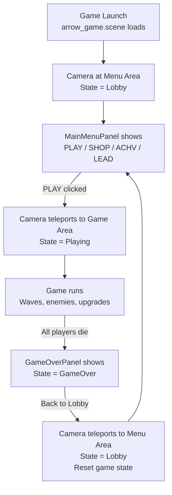

# Single-Scene Menu + Game Plan (Sausage Survivor Approach)

## Core Concept
One scene (`arrow_game.scene.scene`) contains both the menu area and the game area. The camera teleports between them. No scene loading transitions — multiplayer infrastructure (`NetworkHelper`) persists for the entire session.

## Current Scene Analysis

### arrow_game.scene.scene (will become the combined scene)
- **Game area**: Running track centered near Y=0, walls at Y=-600, camera at Y=-5089
- **Office decor already present**: `office_screen_01`, `office_blinds`, `office_chair` at X=197-243, Y=-360 to -389
- **Components**: GameManager, WaveManager, HudManager, TileRecycler, NetworkHelper (StartServer=true)
- **Lighting**: Dark directional light, fog, 2D skybox
- **Music**: "western mystery club" (game), ambience

### lobby.scene (will be deprecated)
- **Map**: `facepunch.c_serverroom` office room
- **Camera**: at (136, -204, 186) — close to office furniture
- **Components**: GameManager, LobbyHudManager, NetworkHelper (StartServer=true)
- **Dog**: Coffee dog buddy at (113, -531, 130)
- **Music**: "pleasant time" (menu)
- **Lighting**: Warm spot + point lights

## Proposed Changes

### 1. Scene Editing (in S&Box Editor)

Add a **Menu Area** to `arrow_game.scene.scene` positioned near the existing office furniture (approx X=200, Y=-400):

| Element | Details |
|---------|---------|
| Menu Camera position | Near office furniture, looking toward desk + chair + dog |
| Coffee Dog Buddy model | Imported from lobby.scene, positioned on/next to desk |
| Warm point/spot lights | To distinguish menu area from the darker game area |
| Menu music source | "pleasant time" sound (from lobby), plays only when State=Lobby |
| Menu spawn point marker | Where players appear when in menu mode |

The game area (running track, walls, spawns) stays exactly as-is at Y=0 to Y=-600.

### 2. Code Changes

#### GameManager.cs
```csharp
// Remove these:
// [Property] public string GameScenePath { get; set; }  // no longer needed
// [Property] public string LobbyScenePath { get; set; }  // no longer needed
// public void StartGame() → Scene.LoadFromFile()  // replaced
// public void ReturnToLobby() → Scene.LoadFromFile()  // replaced
// public void SoloStart()  // replaced
// public void HostStartGame()  // replaced

// Add:
[Property] public GameObject MenuCamera { get; set; }  // camera rig for menu view

// Replace StartGame():
public void StartGame()
{
    State = GameState.Playing;
    TeleportCameraToGame();
    // WaveManager starts automatically via existing OnUpdate() check
}

// Replace ReturnToLobby():
public void ReturnToLobby()
{
    State = GameState.Lobby;
    TeleportCameraToMenu();
    // Reset player positions, clear enemies/waves
}

private void TeleportCameraToGame()
{
    var camera = Scene.GetAllComponents<CameraComponent>()
        .FirstOrDefault(c => c.IsMainCamera);
    if (camera.IsValid())
    {
        // Teleport to game camera position
        camera.WorldPosition = new Vector3(0, -5089, 250);
        camera.WorldRotation = ...;
    }
}

private void TeleportCameraToMenu()
{
    var camera = Scene.GetAllComponents<CameraComponent>()
        .FirstOrDefault(c => c.IsMainCamera);
    if (camera.IsValid())
    {
        // Teleport to menu camera position
        camera.WorldPosition = MenuCamera.WorldPosition;
        camera.WorldRotation = MenuCamera.WorldRotation;
    }
}
```

#### GameOverPanel.razor
```csharp
// Change OnPlayAgain() from:
Scene.LoadFromFile( "scenes/lobby.scene" );
// To:
var gm = Scene.GetAllComponents<GameManager>().FirstOrDefault();
gm?.ReturnToLobby();
```

#### MainMenuPanel.razor
- Already uses `gm.State == GameManager.GameState.Lobby` — **no changes needed**
- PLAY button already calls `gm.StartGame()` — just needs to be updated to teleport instead of load

#### HudManager.cs
- Already only creates game UI (GameHud, UpgradePanel, GameOverPanel, Chatbox) — **no changes needed**

#### LobbyHudManager.cs
- Currently creates MainMenuPanel + Chatbox in the lobby scene
- Since we're merging into one scene, this can either be:
  - Merged into HudManager (both menu and game UI managed in one place)
  - OR kept separate, added to the arrow_game scene

### 3. Files to Remove

| File | Reason |
|------|--------|
| `Assets/scenes/lobby.scene` | No longer needed — merged into arrow_game.scene.scene |
| `Assets/scenes/lobby.scene_d` | Scene backup, no longer needed |
| `Code/UI/LobbyHudManager.cs` | MainMenuPanel added via HudManager instead |

### 4. Scene Transition Flow



### 5. Key Differences from Current Approach

| Aspect | Current (separate scenes) | New (single scene) |
|--------|--------------------------|-------------------|
| Scene transition | `Scene.LoadFromFile()` — full reload | Camera teleport — instant |
| NetworkHelper | Created per scene, resets | Persists entire session |
| Music | Changes with scene | Managed by GameManager state |
| Loading delay | ~1-3 seconds | None |
| Player connection | Re-joins each scene | Stays connected |
| lobby.scene | Separate file | Deprecated/deleted |

### 6. Implementation Status

#### Code Changes — ✅ Done

| File | Change |
|------|--------|
| [`Code/GameManager.cs`](Code/GameManager.cs) | Added `MenuCameraPosition` property. Replaced `StartGame()` / `ReturnToLobby()` with camera teleport. Removed auto-start OnUpdate check (no longer needed). Removed `HostStartGame()`, `SoloStart()`, scene path properties. |
| [`Code/UI/GameOverPanel.razor`](Code/UI/GameOverPanel.razor:153) | `OnPlayAgain()` now calls `gm.ReturnToLobby()` instead of `Scene.LoadFromFile()` |
| [`Code/UI/HudManager.cs`](Code/UI/HudManager.cs:24) | Added `MainMenuPanel` creation (merged from LobbyHudManager) |
| [`Code/UI/LobbyHudManager.cs`](Code/UI/LobbyHudManager.cs) | No longer referenced — keep as-is or delete |

#### Scene Editing — 🔧 You Do in S&Box Editor

In `arrow_game.scene.scene`, create these GameObjects:

| GameObject | Components | Purpose |
|------------|-----------|---------|
| `MenuCameraPosition` | (none — just Transform) | Marker for where the main camera goes during menu. Position near office desk ~`(200, -400, 185)`. |
| `MenuDog` | `ModelRenderer` (model: `model/coffeedogbuddy.vmdl`), optional `LobbyDogAnimator` | Coffee dog buddy on the desk |
| `MenuLight` | `PointLight` (warm color) | Warm lighting to distinguish menu area |
| `MenuMusic` | `SoundPointComponent` (sound: `"music/pleasant time.sound"`) | Menu background music |

Then on the existing `GameManager` GameObject, drag `MenuCameraPosition` into the new `MenuCameraPosition` property slot.

#### Files to Delete (optional)
- `Assets/scenes/lobby.scene`
- `Assets/scenes/lobby.scene_d`
- `Code/UI/LobbyHudManager.cs` (if you want to clean up)
